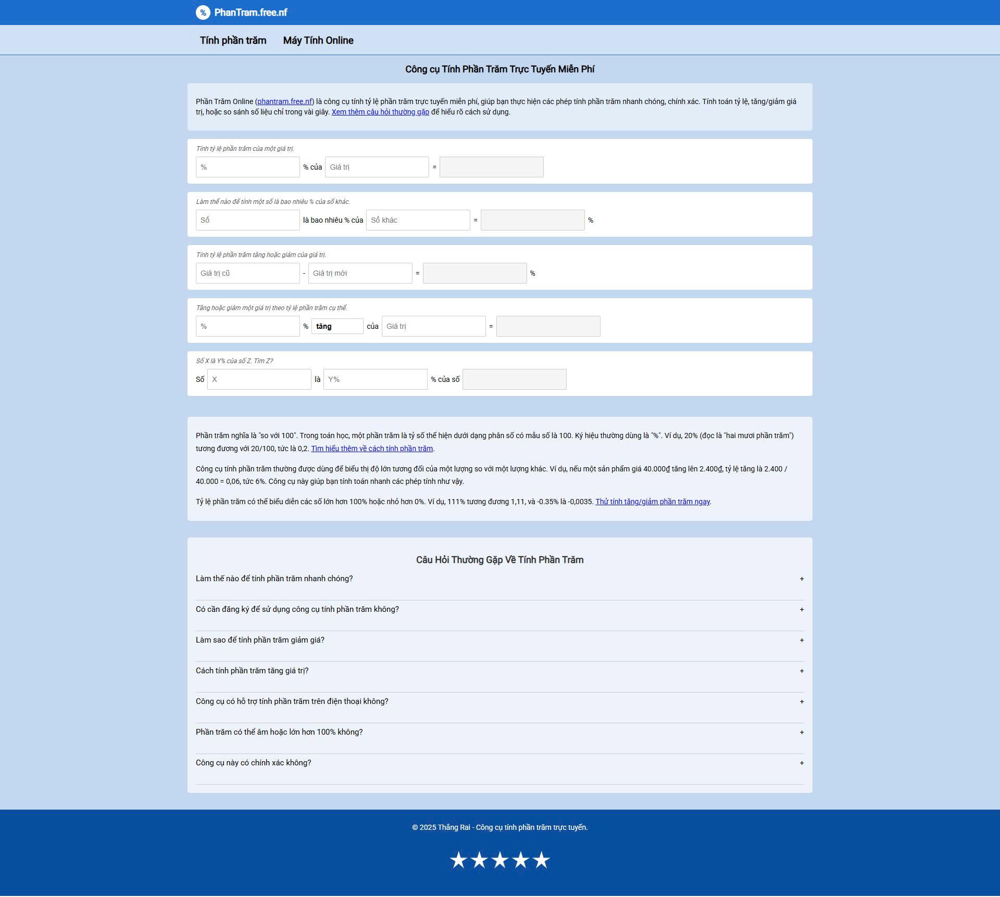

# Phần Trăm Online – Công Cụ Tính Phần Trăm Nhanh & Chính Xác

**phantram.free.nf** là công cụ miễn phí giúp bạn **tính phần trăm**, **giảm giá**, **tăng giảm phần trăm**, và các phép tính phần trăm phổ biến khác một cách nhanh chóng, đơn giản, chính xác.

🌐 Truy cập ngay: [https://phantram.free.nf](https://phantram.free.nf)

---

## 🚀 Tính Năng Nổi Bật

- ✅ Tính phần trăm của một số bất kỳ
- ✅ Tính giảm giá theo phần trăm
- ✅ Tính phần trăm tăng hoặc giảm
- ✅ Tìm giá trị gốc khi biết phần trăm
- ✅ Không quảng cáo, miễn phí 100%
- ✅ Giao diện trực quan, dễ sử dụng

---

## 🎯 Mục Tiêu Dự Án

Mang đến một công cụ **tính phần trăm online đơn giản, nhanh chóng, chính xác** cho học sinh, sinh viên, giáo viên, nhân viên văn phòng, chủ shop, và tất cả mọi người.

---

## 📱 Tương Thích Mọi Thiết Bị

- Hoạt động tốt trên điện thoại, máy tính bảng và máy tính bàn
- Hỗ trợ PWA – Có thể cài đặt như một ứng dụng
- Tốc độ tải nhanh, không tốn dữ liệu

---

## 📸 Giao Diện Thân Thiện

---

## 🛠️ Công Nghệ

- HTML5, Tailwind CSS, JavaScript
- Progressive Web App (PWA)
- Chuẩn SEO – Tối ưu hóa từ khóa, tốc độ, cấu trúc HTML

---

## 🔧 Hướng Dẫn Đóng Góp

1. Fork repository
2. Tạo nhánh mới từ `main`
3. Commit thay đổi của bạn
4. Gửi Pull Request để xem xét

---

## 📄 Giấy Phép

Dự án **phantram.free.nf** được phát hành theo giấy phép [MIT License](LICENSE).

---

## 📬 Liên Hệ

- Website chính thức: [https://phantram.free.nf](https://phantram.free.nf)
- Email liên hệ: *(thêm nếu có)*
- Facebook / GitHub / Twitter: *(thêm nếu có)*

---

> Cảm ơn bạn đã sử dụng **Phần Trăm của Tôi** – Chúng tôi luôn sẵn sàng lắng nghe góp ý để cải thiện công cụ này tốt hơn nữa.
